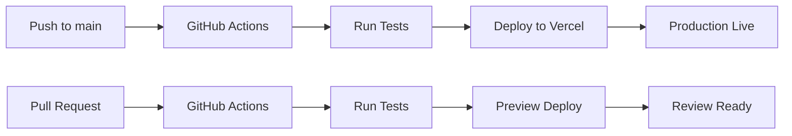

# 🚀 Guia de Deploy - ND Express

## 📋 Pré-requisitos

- Conta no [Vercel](https://vercel.com)
- Conta no [Supabase](https://supabase.com)
- Chave da API [OpenAI](https://platform.openai.com/api-keys)
- Repositório GitHub configurado

## 🔧 Configuração do Vercel

### 1. Conectar Repositório

1. Acesse [vercel.com](https://vercel.com)
2. Clique em "New Project"
3. Importe o repositório `ramonpmendesx3012/ND`
4. Configure as seguintes opções:
   - **Framework Preset**: Other
   - **Build Command**: `npm run build`
   - **Output Directory**: `.`
   - **Install Command**: `npm install`

### 2. Variáveis de Ambiente

Configure as seguintes variáveis no Vercel:

```env
# OpenAI Configuration
OPENAI_API_KEY=sk-proj-...

# Supabase Configuration
SUPABASE_URL=https://seu-projeto.supabase.co
SUPABASE_ANON_KEY=eyJhbGciOiJIUzI1NiIsInR5cCI6IkpXVCJ9...
```

**Como adicionar:**
1. No dashboard do Vercel, vá para o projeto
2. Clique em "Settings" → "Environment Variables"
3. Adicione cada variável individualmente
4. Marque todos os ambientes (Production, Preview, Development)

### 3. Deploy Automático

Após a configuração:
- Cada push na branch `main` dispara deploy automático
- Pull requests geram preview deployments
- GitHub Actions executa testes antes do deploy

## 🔒 Configuração de Segurança

### GitHub Secrets

Para o GitHub Actions funcionar, configure os seguintes secrets:

1. Vá para o repositório no GitHub
2. Settings → Secrets and variables → Actions
3. Adicione os seguintes secrets:

```
VERCEL_TOKEN=seu_token_vercel
VERCEL_ORG_ID=seu_org_id
VERCEL_PROJECT_ID=seu_project_id
```

**Como obter os valores:**

**VERCEL_TOKEN:**
1. Acesse [Vercel Settings](https://vercel.com/account/tokens)
2. Crie um novo token
3. Copie o valor

**VERCEL_ORG_ID e VERCEL_PROJECT_ID:**
1. No terminal, dentro do projeto:
   ```bash
   npx vercel link
   ```
2. Os IDs serão salvos em `.vercel/project.json`

## 📊 Configuração do Supabase

### 1. Criar Projeto

1. Acesse [supabase.com](https://supabase.com)
2. Crie um novo projeto
3. Anote a URL e a chave anônima

### 2. Configurar Banco de Dados

Execute o script SQL fornecido:

```sql
-- Cole o conteúdo do arquivo supabase-setup.sql
-- no SQL Editor do Supabase
```

### 3. Configurar Storage

1. Vá para Storage no painel do Supabase
2. Crie um bucket chamado `comprovantes`
3. Configure as políticas conforme `GUIA-BUCKET-SUPABASE.md`

## 🧪 Teste do Deploy

### 1. Verificar Aplicação

- Acesse a URL do Vercel
- Teste upload de comprovantes
- Verifique integração com OpenAI
- Confirme persistência no Supabase

### 2. Verificar GitHub Actions

- Faça um commit na branch `main`
- Verifique se o workflow executa
- Confirme deploy automático

### 3. Teste de Pull Request

- Crie uma branch de feature
- Abra um pull request
- Verifique se o preview deploy é criado

## 🔄 Workflow de Deploy



## 📈 Monitoramento

### Vercel Analytics

- Acesse o dashboard do Vercel
- Vá para "Analytics" para ver métricas
- Monitore performance e erros

### Logs de Deploy

- Verifique logs no Vercel
- Monitore GitHub Actions
- Acompanhe erros no Supabase

## 🚨 Troubleshooting

### Erro de Build

```bash
# Verificar sintaxe JavaScript
node -c script.js
node -c config.js
```

### Erro de Variáveis de Ambiente

- Verifique se todas as variáveis estão configuradas
- Confirme se os valores estão corretos
- Teste localmente com `.env`

### Erro de Supabase

- Verifique URL e chave
- Confirme políticas de acesso
- Teste conexão no console

### Erro de OpenAI

- Verifique chave da API
- Confirme créditos disponíveis
- Teste modelo GPT-4 Vision

## 📞 Suporte

- **Vercel**: [Documentação](https://vercel.com/docs)
- **Supabase**: [Documentação](https://supabase.com/docs)
- **OpenAI**: [Documentação](https://platform.openai.com/docs)
- **GitHub Actions**: [Documentação](https://docs.github.com/actions)

---

**🎉 Parabéns! Seu ND Express está pronto para produção!**